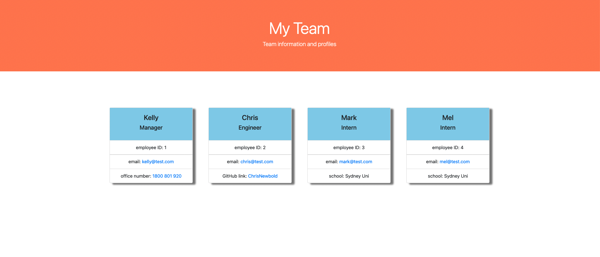

# 10 Object-Oriented Programming: Team Profile Generator

## My Task

1. Build a Node.js command-line application that takes in information about employees on a software engineering team, then generates an HTML webpage that displays summaries for each person.
2. Testing is key to making code maintainable, so you’ll also write a unit test for every part of your code and ensure that it passes each test.
3. Provide a link to a walkthrough video that demonstrates its functionality and all of the tests passing. Submit a link to the video AND add it to the readme of your project.

## User Story

```md
AS A manager
I WANT to generate a webpage that displays my team's basic info
SO THAT I have quick access to their emails and GitHub profiles
```

## Acceptance Criteria

```md
GIVEN a command-line application that accepts user input
WHEN I am prompted for my team members and their information
THEN an HTML file is generated that displays a nicely formatted team roster based on user input
WHEN I click on an email address in the HTML
THEN my default email program opens and populates the TO field of the email with the address
WHEN I click on the GitHub username
THEN that GitHub profile opens in a new tab
WHEN I start the application
THEN I am prompted to enter the team manager’s name, employee ID, email address, and office number
WHEN I enter the team manager’s name, employee ID, email address, and office number
THEN I am presented with a menu with the option to add an engineer or an intern or to finish building my team
WHEN I select the engineer option
THEN I am prompted to enter the engineer’s name, ID, email, and GitHub username, and I am taken back to the menu
WHEN I select the intern option
THEN I am prompted to enter the intern’s name, ID, email, and school, and I am taken back to the menu
WHEN I decide to finish building my team
THEN I exit the application, and the HTML is generated
```

## Mock-Up

The following image shows a mock-up of the generated HTML’s appearance and functionality:



The following image shows a mock-up of the generated HTML’s appearance and functionality:


The following Video contains all of the below:

1. A walkthrough video that demonstrates the functionality of the team profile generator and passing tests
2. a walkthrough video that shows all four tests passing from the command line
3. A walkthrough video that demonstrates how the user would invoke the application from the command line.
4. A walkthrough video that demonstrates how the user would enter responses to all of the prompts in the application.
5. A example of the generated HTML that matches the user input.


OR head over to

https://drive.google.com/file/d/1DF-7T1aLF_90GMrI8KR8MlOrHfRvo1Qz/view

## Skills Used

[Jest](https://www.npmjs.com/package/jest) for running the unit tests and
[Inquirer](https://www.npmjs.com/package/inquirer/v/8.2.4) for collecting input from the user.
[Node](https://nodejs.org/en/download/) run in the terminal

```bash
node index.js
```

## File Structure

```md
.
├── **tests**/ //jest tests
│ ├── Employee.test.js
│ ├── Engineer.test.js
│ ├── Intern.test.js
│ └── Manager.test.js
├── dist/ // rendered output (HTML) and CSS style sheet  
├── lib/ // classes
├── src/ // template helper code
├── .gitignore // indicates which folders and files Git should ignore
├── index.js // runs the application
└── package.json
```
